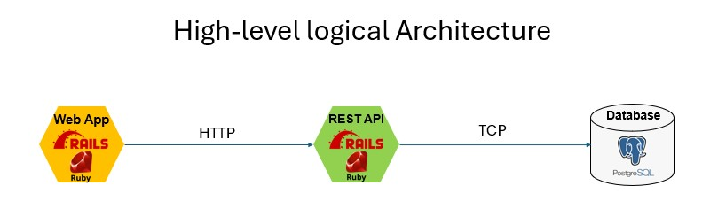
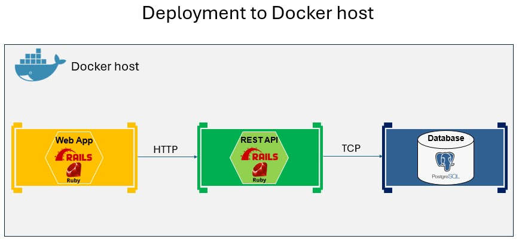
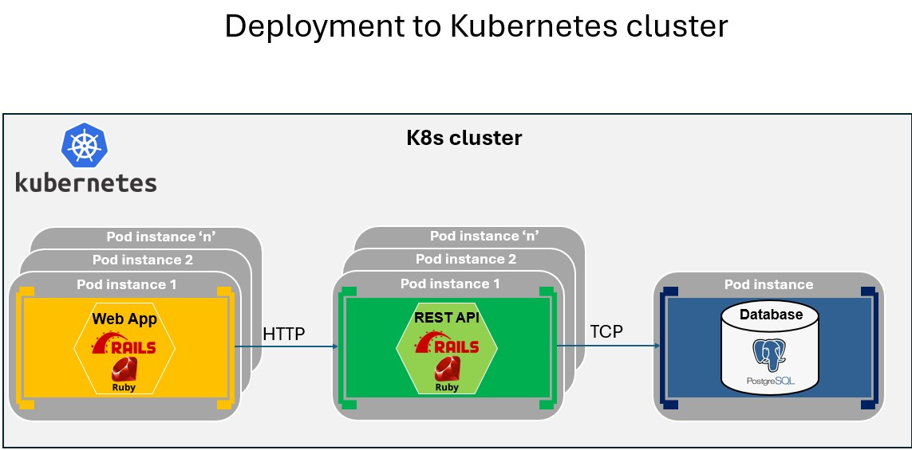
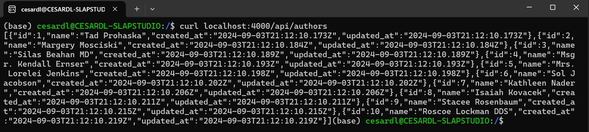
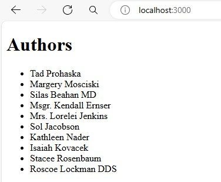

# Ruby on Rails service oriented example application with deployment to Docker and Kubernetes

A POC of Ruby on Rails app with several services, deployed into Docker host and Kubernetes.

Deployment to Kubernetes is developed (YAML code) with two optional methods:

- KUBECTL deployment files
- HELM chart files

# Application architecture

## Plain application architecture

This is the logical app architecture that could be deployed on any compatible environment for Ruby and PostgreSQL.



Note that you can run this application on plain Ruby on Rails, however, you'd need to have the PostgreSQL database hosted in any database server in the first place. That's why for development is also a lot easier to deploy and use the test database as a Docker container. 


## Application architecture deployed to Docker host

You can deploy de whole app into a Docker host (Linux containers) with 'docker compose up', such as the following environments:

- Docker Desktop (for Windows or Mac)
- Docker installed on a Linux box or VM



Note that when deploying to Docker, it's great for development, testing and debugging once deployed with "Docker compose". But for a production environment, a Docker host is not ideal since each container can only have a single instance, so you cannot scale-out at the container level.

## Plain application architecture deployed to Kubernetes cluster

In this repo I implemented two possible approaches when deploying to K8s:

A. **Deploy with KUBECTL** and related deployment .YAML files. This way is recommended when getting started and learning Kubernetes.

B. **Deploy to HELM** and related CHART files. HELM is more advanced and recommended when you have multiple environment stages (Dev, Test, Prod, etc.) in CI/CD and it provides advanced capabilities such as Versioning and Rollbak, Templating, Release management, Conditional logic for CI/CD, etc.)



Note that when deploying to Kubernetes, it's great for a production environment since you can cannot scale out to any number of pod/container instances within the cluster. 


## Database

Of course, the database could always be placed externally to the Docker host or the Kubernetes cluster, in production environments, if needed. But for the sake of simplicity and easyness of deployment of the example app, the database is also deployed in Docker host or Kubernetes cluster as a stateful container.

### Data migrations and seed

As part of the deployment, you will need to run data migrations and seed so the database has some meaningful data to query to from the application (Articles and Authors, for the example).


# Get started

1. **Clone this repo locally.**

```bash
git clone https://github.com/CESARDELATORRE/ruby-rails-service-oriented-app.git
```


2. **Copy/rename the example-rename-to.env to .env:** Since the .env files won't be uploaded to the GitHub repo for security reasons, you need to rename the Copy/rename that file for your own .env file.


# Deployment to Docker host


## Only the first time you deploy it

This section you need to do it just once, the first time you deploy it, because you need to generate example data in te database.

**1. Build the Docker images:**

```bash
docker-compose -f docker-compose.yml up --build
```

**2. Start the app and exit with Ctrl+C:** Basically, you need to have the database container deployed first in order to later run the data migrations and seed.

```bash
docker-compose up
(Wait until the app is deployed)

Exit with Ctrl+C (Do NOT run docker compose down)
```

**3. Data migrations and data seed**


1. Make sure you only left the services with ctrl+c  (DO NOT run docker compose DOWN)

2. Run the following for data migrations:

```bash
docker-compose run articlesrailsapi rails db:migrate
```

3. Run the following for data seed:

```bash
docker-compose run articlesrailsapi rails db:seed
```

## Normal deploy and run (after data migrations/seed are done)

Anytime moving forward after migration/seed you can directly run:

```bash
docker-compose up
```

## Test the app running

The external ports where the services are running when deployed into Docker host are:

- WEB-APP: Port 3000
- WEB-API: Port 4000 

### Test the query WEB API (In Docker host)

From a terminal window:

```bash
curl localhost:4000/api/authors
```

You should see a JSON data with a list of the Authors, like the following:




### Test WebApp HealthCheck (In Docker host)


Simple HealthCheck of Web-App:

http://localhost:3000/healthcheck


### Test the WEB APP (In Docker host)

Web-App returning the Authors list:

http://localhost:3000/

or

http://localhost:3000/authors/




### Stop the app in Docker

```bash
docker-compose down
```


## Additional commands for Docker

Additional commands are in this utils file:

[**commands for docker compose.txt**](/commands%20for%20docker%20compose.txt)


# Deployment to Kubernetes

There are two options for Kubernetes deployment in this app:

- OPTION A. Deployment using KUBECTL and .YAML deployment files.

- OPTION B. Deployment using HELM and CHART deployment files.

## Prerequisites

### Kubernetes cluster installation

Make sure you have enabled Kubernetes in Docker for Desktop or install Kubernetes into any Linux box/VM. 

### Install Kubernetes-Dashboard into K8s

This step is optional, but it is very useful to see the app deployments in the graphical dashboard of Kubernetes.

1. (Run just once) Run the following command to deploy the Kubernetes Dashboard:

```bash
kubectl apply -f https://raw.githubusercontent.com/kubernetes/dashboard/v2.7.0/aio/deploy/recommended.yaml
```


2. (Run just once) Create a service account for the dashboard:

```bash
kubectl create serviceaccount dashboard-admin-sa -n kubernetes-dashboard
```


3. (Run just once) Bind the service account to the cluster-admin role

```bash
kubectl create clusterrolebinding dashboard-admin-sa --clusterrole=cluster-admin --serviceaccount=kubernetes-dashboard:dashboard-admin-sa
```


4. Obtain the Bearer Token:

You need to get the token for the service account to login into the dashboard: 

```bash
kubectl -n kubernetes-dashboard create token dashboard-admin-sa
```

5. Access the Kubernetes Dashboard:

You need to start the kubectl proxy in order to reach the dashboard within the cluster:

```bash
kubectl proxy
```


6. Open your web browser and go to:

http://localhost:8001/api/v1/namespaces/kubernetes-dashboard/services/https:kubernetes-dashboard:/proxy/

Provide the token for login, etc.


## OPTION A. Deploy to Kubernetes using KUBECTL

### Only the first time you deploy it

**1. (OPTIONAL) Build the Docker images:**

You ony have to re-build the images if you want to use your own images in case you might have changed the Ruby code, etc.

```bash
docker-compose -f docker-compose.yml up --build
```

**2. (OPTIONAL) Push images to Docker Hub (Docker Images Registry):** 

Kubernetes can only deploy Docker images if they are shared in an accesible Docker Registry. You cannot directly deploy the images from your development machine.

You can use any Docker Images Registry, like Docker Hub.

You ony have to push the images into a Docker Images Registry if you want to use your own images in case you might have changed the Ruby code, etc. In that case, you'd need your own account (i.e. a Docker Hub account) in order to be able to push images into the registry.

Example:

```bash
docker push rubyonrailspocs/frontendwebapp
docker push rubyonrailspocs/articlesrailsapi
```


### Deploy app into Kubernetes (Including Data migrations/seed): 

Run this on the terminal where you have KUBECTL configured against the cluster:

```bash
cd <YOUR-PATH>/k8s/kubectl

kubectl apply -f .
```


### Check the app's deployment in K8s

Before testing the app, let's see how it was deployed in K8s:

**Check deployments**

```bash
kubectl get deployments --namespace ruby-rails-apis-poc
```

**Check pods:**

```bash
kubectl get pods --namespace ruby-rails-apis-poc
```

**Check services:**

```bash
kubectl get services --namespace ruby-rails-apis-poc
```

### Test the app running

The external ports where the services are running when deployed into the KUBERNETES cluster are:

- WEB-APP: Port 30001
- WEB-API: Port 30002 

#### Test the query WEB-API (In Kubernetes)

From a terminal window:

```bash
curl localhost:30002/api/authors
```


#### Test WebApp HealthCheck (In Kubernetes)


Simple HealthCheck of Web-App:

http://localhost:3000/healthcheck


#### Test WEB APP  (In Kubernetes)

Web-App returning the Authors list:

http://localhost:3000/

or

http://localhost:3000/authors/


#### Remove/Uninstall the app from Kubernetes cluster

```bash
kubectl delete -f .
```


### Additional commands for Kubernetes and KUBECTL

Additional commands are in this utils file:

    [**/k8s/helm/Commands to deploy with KUBECTL.txt**](/k8s/kubectl/Commands%20to%20deploy%20with%20KUBECTL.txt)


# OPTION B. Deploy to Kubernetes using HEML

Deploy using HELM and CHART deployment files by using the commands in the following file.

[**/k8s/helm/Commands to deploy with HELM.txt**](/k8s/helm/Commands%20to%20deploy%20with%20HELM.txt)
